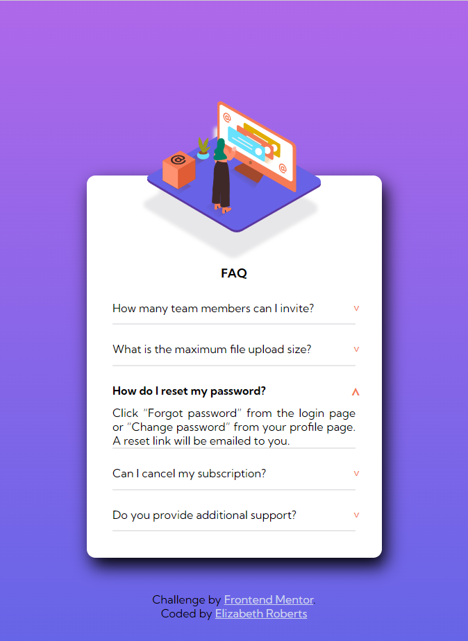

# Frontend Mentor - FAQ accordion card solution

This is a solution to the [FAQ accordion card challenge on Frontend Mentor](https://www.frontendmentor.io/challenges/faq-accordion-card-XlyjD0Oam). Frontend Mentor challenges help you improve your coding skills by building realistic projects. 

## Table of contents

- [Overview](#overview)
  - [The challenge](#the-challenge)
  - [Screenshot](#screenshot)
  - [Links](#links)
- [My process](#my-process)00000
  - [Built with](#built-with)
- [Author](#author)
- [Acknowledgements](#acknoledgements)

## Overview

### The challenge

Users should be able to:

- View the optimal layout for the component depending on their device's screen size
- See hover states for all interactive elements on the page
- Hide/Show the answer to a question when the question is clicked

### Screenshot

### Links

- [Solution](https://github.com/er1927/faq-accordion-card)
- [Live Site](https://faq-accordion-card-mu-jet.vercel.app/)

## My process

### Built with

- Semantic HTML5 markup
- Flexbox
- JavaScript
- Mobile-first workflow

## Author

- Website - [Elizabeth Roberts](https://er1927.github.io/personal-portfolio/)
- Frontend Mentor - [@er1927 ](https://www.frontendmentor.io/profile/er1927)
- Github - [@er1927](https://github.com/er1927)

##Acknowledgements

- Many thanks to [Abdul Khalid](https://www.linkedin.com/in/0xabdulkhalid/) for checking my code and making the most helpful suggestions regarding the HTML structure of the accordion element.
